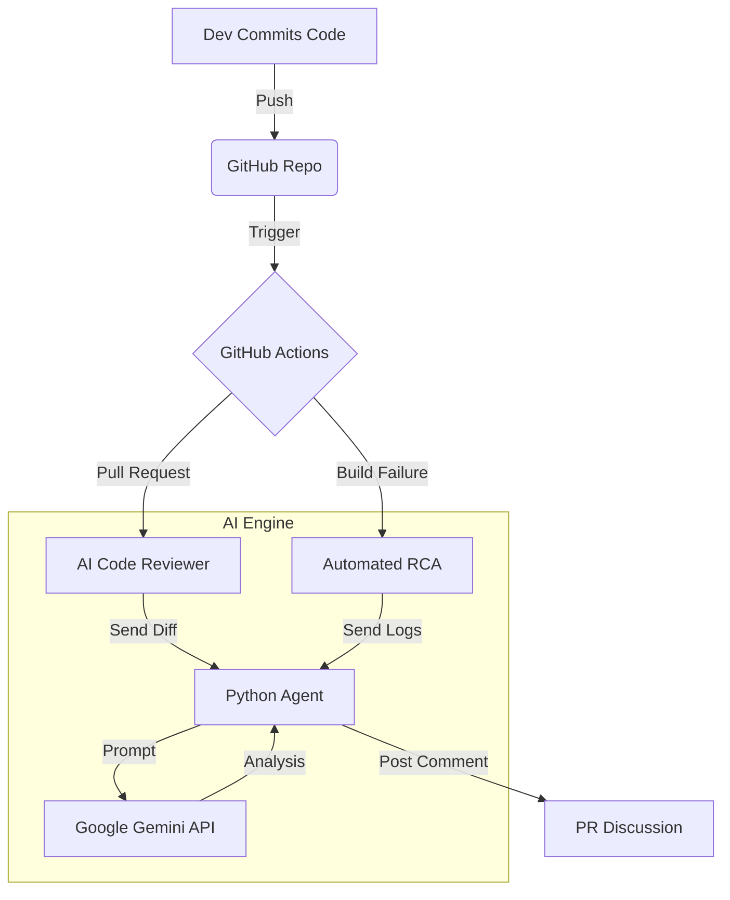

# AI-Powered CI/CD Pipeline 🤖


A self-healing, intelligent CI/CD pipeline that uses **Google Gemini 1.5 Pro** to perform automated code reviews, detect security vulnerabilities, and suggest fixes for build failures.

## 🚀 Features

- **🤖 AI Agent Code Reviewer**: Automatically analyzes Pull Request diffs for:
  - 🛡️ **Security Vulnerabilities** (API keys, injection flaws, bad permissions)
  - ⚡ **Performance Anti-patterns** (N+1 queries, memory leaks)
  - 🧹 **Code Quality** (SOLID principles, readability)
- **🧠 Automated Root Cause Analysis (RCA)**:  Parses build logs when a pipeline fails and generates specific fix suggestions.
- **💬 ChatOps Integration**: Posts review summaries and fix suggestions directly to GitHub PR comments.

## 🏗️ Architecture



## 🛠️ Setup

1. **Prerequisites**
   - GitHub Repository
   - Google Gemini API Key (Get it from [Google AI Studio](https://aistudio.google.com/))

2. **Installation**
   - Copy `.github/workflows/ai-review.yml` to your repository.
   - Copy `scripts/ai_reviewer.py` and `requirements.txt` to `scripts/`.

3. **Configuration**
   - Go to **Settings > Secrets and variables > Actions**.
   - Add a new repository secret: `GOOGLE_API_KEY`.

## 💻 Usage

### Automated Code Review
Just open a Pull Request! The AI agent will automatically:
1. Detect changes.
2. Analyze the diff.
3. Post a detailed review as a comment.

### Example Output

> **🤖 AI Code Review (Gemini 1.5)**
> 
> | Category | Status | Details |
> |----------|--------|---------|
> | **Security** | ⚠️ Warn | Hardcoded API key detected in `config.py` |
> | **Performance** | ✅ Pass | No obvious bottlenecks |
> | **Quality** | ℹ️ Info | Consider extracting `process_data` logic to a helper function |
> 
> **Findings:**
> 1. `config.py:12`: **Security Risk** - Never commit secrets. Use environment variables.
>    ```python
>    - api_key = "sk-123456789"
>    + api_key = os.getenv("API_KEY")
>    ```

## 📄 License
MIT
