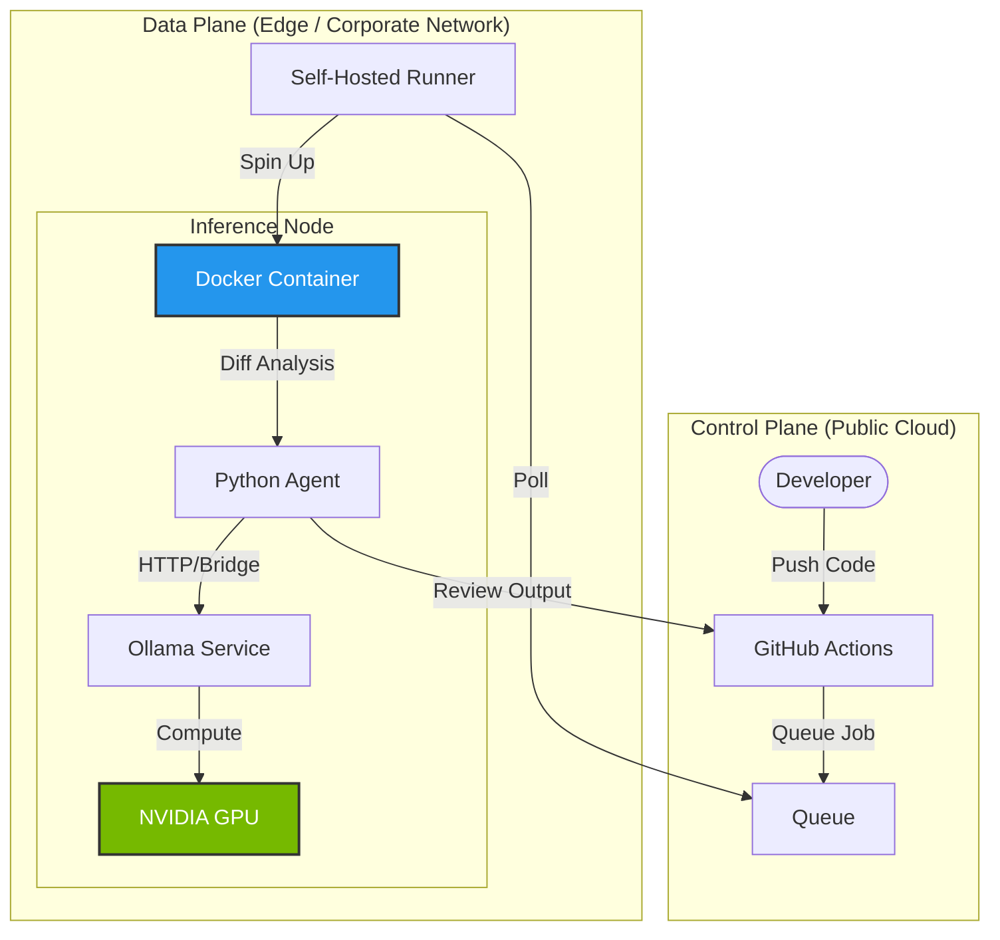

# AI-Native Hybrid CI/CD Pipeline
  

A production-grade, self-healing CI/CD pipeline architecture that bridges **Cloud Automation** (GitHub Actions) with **Edge AI Compute** (Self-Hosted GPU Runners).

It performs automated code reviews and root cause analysis (RCA) using a **Hybrid Inference Engine**—routing requests to low-latency cloud models (Groq) or secure, zero-cost local models (Qwen 2.5 via Ollama) based on data privacy requirements.

## 🚀 Key Differentiators

### 🔒 Privacy-First "Air-Gapped" Mode
Unlike standard AI tools that send code to external APIs, this pipeline supports **Local Inference**.
*   **Infrastructure:** Runs on **GitHub Self-Hosted Runners** connected to local GPU resources (NVIDIA RTX).
*   **Data Sovereignty:** Proprietary code never leaves the local network (Zero Egress).
*   **FinOps:** Eliminates API token costs by utilizing existing hardware for inference.

### 🤖 Intelligent Code Reviewer
A Python-based agent that sanitizes and analyzes Pull Requests:
*   **Security Analysis:** Detects hardcoded secrets, injection flaws, and IAM permission risks (SAST).
*   **Performance Audits:** Identifies N+1 queries and memory leaks.
*   **Logic Verification:** Uses chain-of-thought reasoning to validate business logic.

### 🧠 Automated Root Cause Analysis (RCA)
*   **Log Parsing:** Automatically captures build failure logs from the runner.
*   **Contextual Remediation:** Feeds errors to the LLM to generate specific fix code blocks.
*   **ChatOps:** Posts the fix directly to the PR comments.

---

## 🏗️ Hybrid Architecture

This system uses a **Split-Plane Architecture** to combine the convenience of GitHub with the power of local GPUs.



## 🛠️ Setup & Configuration

### Option A: Cloud Mode (Groq/Gemini)
Best for speed and public repositories.
1.  Add `GROQ_API_KEY` to GitHub Secrets.
2.  Set `LLM_PROVIDER` var to `groq`.
3.  Runs on standard GitHub Ubuntu runners.

### Option B: Edge Mode (Ollama/Local)
Best for privacy and cost savings.
1.  **Host Setup:** Install Ollama and pull the model: `ollama pull qwen2.5-coder:7b`.
2.  **Runner:** Install the GitHub Self-Hosted Runner on the GPU machine.
3.  **Network:** The Docker container connects to the host via `host.docker.internal` to access the GPU API.

## 💻 Usage Example

### 1. Automated Security Audit
Just open a Pull Request. The Agent automatically scans the diff.

**Example Output:**

> **🤖 AI Code Review (Model: Qwen 2.5-Coder)**
> 
> | Category | Status | Findings |
> |----------|--------|----------|
> | **Security** | ⚠️ High | Hardcoded API Key detected in `config.py` line 12. |
> | **Performance** | ✅ Pass | No bottlenecks detected. |
> 
> **Suggestion:**
> ```python
> - api_key = "sk-12345"
> + api_key = os.getenv("API_KEY")
> ```

### 2. Automated Root Cause Analysis (RCA)
If a build fails (e.g., Java syntax error), the **AI RCA Agent**:
1.  Automatically triggers on the failure event.
2.  Parses the logs to isolate the error stack trace.
3.  Feeds the context to the local Ollama LLM.
4.  Posts the proposed fix as a comment on the PR.

> **🔍 AI Diagnosis:**
> "The error `package java.util.lists does not exist` indicates a typo. Replace with `java.util.List`."

---

## 🛡️ Technical Deep Dive (War Stories)

Implementing "Air-Gapped" AI on Windows presented specific challenges that required enterprise-grade solutions:

*   **The PowerShell Restriction:** Corporate execution policies (`Restricted`) blocked standard GitHub runners.
    *   **Solution:** Forced `shell: cmd` for all steps to bypass PowerShell completely.
*   **The CRLF Trap:** Scripts written on Windows (`\r\n`) broke inside Linux Docker containers.
    *   **Solution:** Implemented dynamic script sanitization (`sed -i 's/\r$//'`) at container runtime.
*   **Docker Host Networking:** Containers couldn't access the host's GPU API by default.
    *   **Solution:** Mapped `http://host.docker.internal:11434` and bound Ollama to `0.0.0.0`.

## 🔮 Roadmap
*   **Predictive Scaling:** Integrate Terraform with historical metrics to adjust resource limits dynamically.
*   **Vector DB Integration:** Store past code reviews to prevent the AI from flagging the same "won't fix" issues twice.

## 📄 License
MIT
