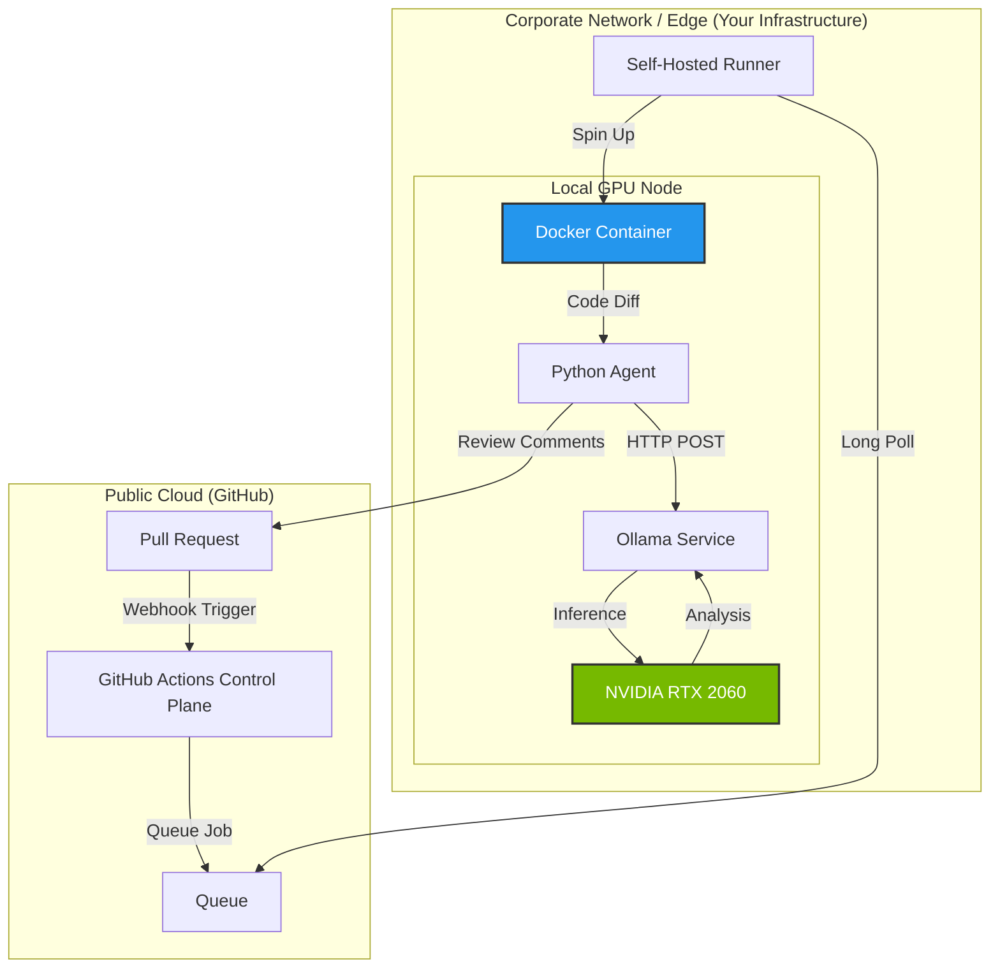

# AI-Powered CI/CD Pipeline & Code Reviewer
  

A self-healing, intelligent CI/CD pipeline architecture that integrates **Local Generative AI** into the software delivery lifecycle. It performs automated code reviews, detects security vulnerabilities (SAST), and provides Automated Root Cause Analysis (RCA) for build failures. Uses **Ollama + Qwen 2.5 Coder** for private, free, and unlimited inference.

> **Status:** Reference Implementation (Architecture Phase)

## 🚀 Key Features

### 🤖 Intelligent Code Reviewer
A Python-based agent that hooks into GitHub Pull Requests:
*   **Security Analysis:** Detects hardcoded secrets, injection flaws, and IAM permission risks.
*   **Performance Audits:** Identifies N+1 queries, memory leaks, and inefficient loops.
*   **Style Enforcer:** Checks for SOLID principles and maintainability.

### 🧠 Automated Root Cause Analysis (RCA)
*   **Log Parsing:** Automatically captures build failure logs from GitHub Actions.
*   **Contextual Remediation:** Feeds errors to the Local LLM (Ollama) to generate specific fix code blocks.
*   **ChatOps:** Posts the fix directly to the PR comments.

### 📈 Predictive Scaling (Architecture)
*   **Traffic Forecasting:** Ingests historical metrics to predict resource usage.
*   **Dynamic Terraform:** (Roadmap) Adjusts `requests/limits` in Terraform plans prior to deployment based on predicted load.

---

## 🏗️ Architecture



## 🔧 Implementation Details
*   **Cross-Platform Compatibility:** Engineered execution wrappers (`cmd`, `git-bash`) to ensure pipeline reliability across heterogeneous OS environments (Windows/Linux) without modifying host security policies.
*   **Service-Level Architecture:** Configured the Docker Daemon and Runner service for headless operation, ensuring stability across reboots using Windows Service isolation.
*   **Resiliency Patterns:** Implemented exponential backoff logic in the Python API client to handle the variability of local GPU inference latency.

## 🛠️ Setup & Configuration

### Prerequisites
*   GitHub Repository with Actions enabled.
*   **Ollama** running locally (`ollama serve`).
*   **Self-Hosted Runner** configured on the same machine.

### Installation
1.  **Workflows**: Copy `.github/workflows/ai-review.yml`.
2.  **Runner**: Set up a self-hosted runner in GitHub Settings -> Actions -> Runners.
3.  **Run**: Start the runner with `./run.cmd`. No API keys needed!

## 💻 Usage Example

### 1. Automated Security Audit
Just open a Pull Request. The Agent automatically scans the diff.

**Example Output:**

> **🤖 AI Code Review**
> 
> | Category | Status | Findings |
> |----------|--------|----------|
> | **Security** | ⚠️ High | Hardcoded API Key detected in `config.py` line 12. |
> | **Performance** | ✅ Pass | No bottlenecks detected. |
> 
> **Suggestion:**
> ```python
> - api_key = "sk-12345"
> + api_key = os.getenv("API_KEY")
> ```

## 🔮 Roadmap
*   **Vector DB Integration**: Store past code review feedback to prevent repeat errors.
*   **Predictive Scaling**: Implement the Terraform dynamic variable injection based on Prometheus metrics.

## 📄 License
MIT
