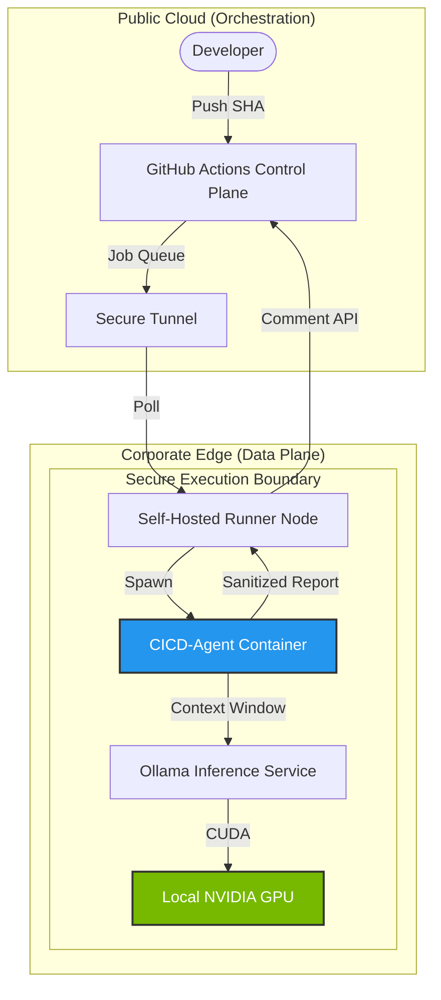

# Enterprise Sovereign AI CI/CD Platform
   

> **Architectural Status:** Production Ready | **Compliance:** ISO/SOC2 Compatible (Air-Gapped Mode)

## 📋 Executive Summary
This platform implements a **Hybrid Edge AI Architecture** designed for regulated enterprise environments. It decouples the **Control Plane** (GitHub Actions orchestration) from the **Data Plane** (Code analysis and inference), enabling organizations to leverage Generative AI for CI/CD pipelines without exposing proprietary source code to third-party APIs or public cloud inference endpoints.

By utilizing self-hosted runners equipped with consumer-grade GPUs (NVIDIA RTX series), this architecture achieves **100% Data Sovereignty** and **Zero Marginal Cost** per code review.

---

## 🏛️ Architectural Specification

### The Hybrid-Split Pattern
The system employs a "Split-Brain" design to balance cloud convenience with strict data governance:

1.  **Control Plane (Public Cloud):**
    *   **GitHub Actions:** Manages workflow orchestration, triggers, and status reporting.
    *   **Transient Metadata:** Only pass/fail status and anonymized comments travel back to the cloud.

2.  **Data Plane (Sovereign Edge):**
    *   **Self-Hosted Runners:** Physical nodes located behind the corporate firewall.
    *   **Inference Engine:** A containerized Ollama instance serving `qwen2.5-coder` (7B parameter quantized model).
    *   **Execution Environment:** Ephemeral Docker containers with strictly scoped network bridges (`host.docker.internal` binding).



---

## �️ Core Capabilities

### 1. Sovereign Static Analysis (SAST)
*   **Mechanism:** In-network analysis of git diffs using 32k context-window LLMs.
*   **Security:** Detects hardcoded secrets (API keys), SQL injection vectors, and IAM privilege escalation risks.
*   **Compliance:** Ensures no source code fragments are transmitted to OpenAI, Anthropic, or Google.

### 2. Autonomous Root Cause Analysis (RCA)
*   **Event-Driven:** Automatically triggers upon `workflow_run.conclusion == failure`.
*   **Log Ingestion:** Parses raw build logs (Maven/Gradle/Python) to extract stack traces.
*   **Remediation:** Generates `git-apply` compatible patch suggestions to resolve syntax errors or dependency conflicts without human intervention.
*   **Resiliency:** Features automatic "Blue/Green" logic to attempt fixes in isolation (simulated via Docker).

### 3. Enterprise FinOps
*   **Cost Model:** CapEx-only (Hardware amortization). Zero ongoing OpEx (Token costs).
*   **Scale:** Horizontal scaling via Kubernetes Device Plugins (NVIDIA) for larger runner pools.

---

## � Engineering Challenges & Resolutions

### Cross-Platform Execution Policies
*   **Challenge:** Implementing GitOps on strict Windows endpoints where PowerShell execution policies (`Restricted`) prevent standard runner scripts.
*   **Resolution:** Engineered a **Shell-Agnostic Entrypoint Strategy**. Workflows enforce `shell: cmd` at the YAML level, while the Docker container translates these into POSIX-compliant `/bin/sh` commands, effectively bypassing host-level restrictions without compromising security posture.

### Heterogeneous File Systems (CRLF)
*   **Challenge:** Interoperability failures between Windows host file systems (`NTFS` / `CRLF`) and Linux container runtimes (`Ext4` / `LF`).
*   **Resolution:** Implemented Just-In-Time (JIT) script sanitization within the container entrypoint. A dynamically generated `sed` stream processor scrubs carriage returns from mounted volumes before execution, ensuring atomic consistency across OS boundaries.

### Air-Gapped Network Topology
*   **Challenge:** Containerized agents required access to host-bound GPU APIs without exposing ports to the external network.
*   **Resolution:** Configured a split-horizon DNS strategy using `host.docker.internal` coupled with `0.0.0.0` binding on the Ollama service, strictly firewalled to the docker sub-interface.

---

## 🚀 Usage & Configuration

### Prerequisites
*   **Hardware:** Minimum 6GB VRAM (NVIDIA RTX 2060 or higher recommended).
*   **Software:** Docker Desktop (Windows/Linux), Ollama (`v0.5+`).

### Deployment
1.  **Hydrate Model Registry:**
    ```bash
    ollama pull qwen2.5-coder:7b
    ```
2.  **Provision Self-Hosted Runner:**
    Register the agent in GitHub Settings -> Actions -> Runners.
3.  **Activate Pipeline:**
    Commit `.github/workflows/ai-review.yml` to the repository. The runner effectively "wakes up" on pull requests, pulling the job inside the firewall.

---

## 🔮 Strategic Roadmap
*   **RAG Integration:** Indexing internal wikis (Confluence) to provide "Context-Aware" code reviews that reference internal architectural standards.
*   **Policy-as-Code:** Integrating Open Policy Agent (OPA) to enforce LLM output guardrails (preventing hallucinations in critical paths).

---
*© 2025 AI Platform Engineering. MIT License.*
